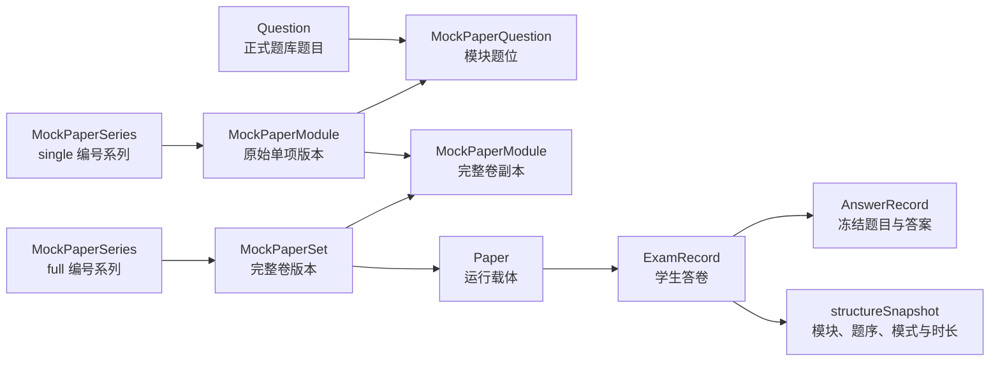

# 3.5 模考中心组卷与作答实现

> 更新日期：2026-09-13  
> 适用范围：ESAT、TMUA 模考试卷库后台，学生模考目录、单项模考、完整模考、分段作答、成绩与历史。  
> 实现依据：当前 `api/`、`quiz-web/` 和 Prisma schema。本文件已合并原《模考试卷编号规则与迁移》《模考试卷库组卷逻辑审计-2026-09-07》《修复说明-模考单项替换漏更新》三份文档。

## 1. 当前结论

模考中心采用“题库题目 → 原始单项版本 → 完整卷模块副本 → 运行 Paper → 冻结答卷快照”的结构。后台 Excel 导入只创建独立单项，管理员再显式选择单项组成完整卷；单项和完整卷拥有各自的编号、版本、发布状态和学生入口。

当前主链路已经具备以下保护：

- 完整卷与单项分别编号、分别换版，历史编号和答卷关系保留；
- 完整卷副本记录具体来源单项版本，题目替换时能反向更新当前引用方；
- 下线共用运行 `Paper` 中的一个单项时，会重新计算剩余开放入口；
- 完整卷与单项的新建答卷都使用请求标识防止同一次点击重复创建；
- 答卷开始后使用结构快照和 `AnswerRecord`，母卷后续变化不会改写历史题序；
- 分段保存、暂停、恢复、模块锁定和最终交卷复用同一套服务端状态机；
- 完整卷作答可以追溯到来源单项，用于单项“已练习”状态。

本次复核仍确认 8 项需要后续处理的问题，其中 4 项会影响内容不可变性、旧题恢复或答卷生命周期，应优先处理。详见第 10 节。

## 2. 业务对象与数据关系



| 模型 | 职责 |
|---|---|
| `Question` | 唯一正式题目数据源。模考不复制题干、选项和解析。 |
| `MockPaperSeries` | 保存稳定编号身份。`kind=full` 表示完整卷，`kind=single` 表示单项；内部 `sequenceNo` 为整数。 |
| `MockPaperNumberCounter` | 按考试、资产类型和学科维护已分配的最大序号，删除和换版均不回收号码。 |
| `MockPaperSet` | 保存一个完整卷版本，或承载原始单项的隐藏容器。`status` 只表示完整卷生命周期。 |
| `MockPaperModule` | 原始单项或完整卷副本。原始单项拥有 `seriesId/version`；副本通过 `sourceModuleId` 指向具体原始版本。 |
| `MockPaperQuestion` | 按 `moduleId + position` 固定题位，保存上传题号、匹配题目和校验结果。 |
| `MockPaperWorkbookUpload` | 保存原始 `.xlsx` 文件档案、摘要、上传人和处理结果。 |
| `Paper` | 已发布内容的轻量运行载体，用于承接答卷、报告及历史关系，不保存模考题目副本。 |
| `ExamRecord` | 一场独立作答。保存模式、阶段、时限、结构快照、分数和提交状态。 |
| `AnswerRecord` | 在开考时建立，固定本场题目范围、题序、答案、作答状态和单题用时。 |

`MockPaperSet.deletedAt` 有两种既有含义：普通完整卷草稿被软删除，以及原始单项所在的隐藏容器。隐藏容器被标记后，其原始 `MockPaperModule` 仍是有效单项资产，不能把 `deletedAt` 直接解释为单项已删除。

## 3. 考试结构

| 考试 | 可导入模块 | 完整卷规则 | 单项题量与时长 | 完整作答过渡 |
|---|---|---|---|---|
| ESAT | `maths1`、`maths2`、`physics`、`chemistry`、`biology` | 3 至 5 个不同模块，必须包含 `maths1`；学生开考时按个人中心选择取 3 科 | 每科 27 题、40 分钟 | 三模块独立计时，模块间休息 180 秒 |
| TMUA | `paper1`、`paper2` | 必须同时包含两个 Paper | 每卷 20 题、75 分钟 | Paper 1 完成后直接开始 Paper 2 |

`deriveMockPaperReadiness` 是完整卷就绪状态的后端权威规则。所有已加入模块都必须校验通过；ESAT 不能以“已有三科通过”忽略第四或第五科的错误。完整卷目录中的 ESAT 内容再使用 `coversEsatModuleSelection` 检查是否覆盖学生保存的三科组合。

## 4. 编号与版本

### 4.1 编号池

| 编号池 | 示例 |
|---|---|
| ESAT 完整卷 | `ESAT-MOCK-005-V1` |
| ESAT 单项 | `ESAT-MOCK-M1-005-V1`、`ESAT-MOCK-M2-005-V1`、`ESAT-MOCK-B-005-V1` |
| TMUA 完整卷 | `TMUA-MOCK-005-V1` |
| TMUA 单项 | `TMUA-MOCK-P1-005-V1`、`TMUA-MOCK-P2-005-V1` |

完整卷按 `examType + full` 分池；单项按 `examType + single + moduleCode` 分池。内部序号至少显示三位，超过三位时保留完整数字；版本为 `V1/V2`，不补零。

Excel Sheet 名中的 `ESAT01` 或 `TMUA01` 只负责稳定解析同批数据，不是最终业务编号。每个 Sheet 导入为一个原始单项并从对应单项池分号；隐藏容器不消耗完整卷号。管理员组成完整卷时才从完整卷池分配编号。

API 的 `sequenceNo` 返回完整业务编号字符串，数据库 `MockPaperSeries.sequenceNo` 仍是整数。前端直接展示 API 值，不再拼接 `No.` 或版本。缺少有效系列身份时返回 `null`，页面显示 `—`。

### 4.2 版本规则

- 新资产从版本 1 开始；换版沿用同一 `MockPaperSeries`，只递增版本，不重新分号。
- 原始单项按自己的系列判断最新版本，不能按父完整卷版本判断。
- 完整卷版本与其中单项版本独立。例如只换 Mathematics 2 时，其他单项保留原编号、版本和模块 ID。
- 已开放或已有答卷的资产必须通过新版本承接内容变化；从未开放、没有答卷且未进入正式完整卷的草稿允许原位更新。
- 历史完整卷、副本、运行 `Paper`、答卷和题序继续保留，不能迁移到新版本。

### 4.3 已完成的编号迁移

编号改造使用以下两阶段迁移，并追加旧码清理：

1. `20260907150000_add_mock_paper_number_series`：增加系列、计数器和过渡字段；
2. 使用快照与 `mockPaperNumberMigration.ts` 回填存量完整卷、原始单项和来源关系；
3. `20260907153000_replace_mock_paper_codes_with_series`：删除 Set 旧编号列、收紧版本约束；
4. `20260907190000_remove_mock_legacy_code`：删除最终兼容列并清理模考运行 `Paper.code`。

测试和生产环境已通过受控部署器完成该升级。已有数据库不能跳过中间回填，直接连续执行最终迁移；第二阶段依赖仍存在旧列时生成的快照和映射。

本地迁移工具为 `api/scripts/migrate-mock-paper-numbers.ts`。它只允许回环地址的 dev/test MySQL，默认 dry-run，使用被 Git 忽略的快照和映射文件；线上迁移由部署脚本处理，不能通过修改环境名绕过门禁。

## 5. 后台导入、校验与组卷

### 5.1 Excel 导入

后台页面为 `quiz-web/src/views/admin/coreLibrary/MockPaperLibrary.vue`，通过 `quiz-web/src/api/mockPaperAdmin.ts` 调用 `/api/mock-paper-sets`。

上传要求：

- 仅接受一个 `.xlsx`，最大 10 MB；后端同时检查扩展名和 ZIP/XLSX 容器签名；
- Sheet 名使用 `ESAT01-数学1`、`TMUA01-Paper1` 等格式；`套卷配置` Sheet 会被忽略；
- 前三列表头必须为“考试类型、学科、题号（全局唯一）”；
- 每行考试类型、学科和题号必须与 Sheet 一致；
- 原文件保存到受控存储，数据库仅保存相对 `storageKey`，下载需要管理员鉴权。

导入后的每个 Sheet 都创建：

1. 一个 `single` 系列和版本 1；
2. 一个标记 `deletedAt` 的隐藏 `MockPaperSet`；
3. 一个原始 `MockPaperModule`；
4. 按 Excel 顺序创建的 `MockPaperQuestion`；
5. 一次立即校验。

导入不会自动把相同 `ESAT01` 或 `TMUA01` 的 Sheet 组成完整卷。管理员必须在组套弹窗显式选择单项。

### 5.2 题目匹配与校验

每个上传题号同时匹配 `Question.uniqueCode` 和兼容字段 `sourceQuestionCode`。同一题号必须唯一命中。校验内容包括：

- 题号是否为空、超长、重复、不存在或命中多题；
- 题目是否为 `published`；
- 考试类型与 Module/Paper 是否一致；
- 是否为 `single_choice`；
- 是否至少有两个选项且只有一个标准答案；
- 单项题量是否等于正式题量；
- 完整卷是否满足考试结构。

逐题结果写入 `MockPaperQuestion`，单项汇总写入 `MockPaperModule`，整卷问题摘要写入 `MockPaperSet`。完整卷的 `fullExamReady`、`readyModuleCount` 和汇总 `validationStatus` 不存数据库，每次由模块状态实时派生。

管理员手工换题只修改题号引用，不直接编辑 `Question` 内容。修改后重新匹配题库并刷新相关单项和完整卷。

### 5.3 组成完整卷

候选必须同时满足：

- 是原始单项，即 `sourceModuleId=null`；
- 有 `single` 系列且是该系列最高版本；
- 校验通过；
- 位于隐藏来源容器；
- 当前没有被其他完整卷副本占用；
- 与目标卷考试一致且不重复学科。

新建完整卷使用 Serializable 事务完成候选复核、占用检查、完整卷分号和副本创建。完整卷副本复制当时的题位、校验与显示信息，并用 `sourceModuleId` 指向具体来源版本。数据库允许历史上多个副本引用同一来源版本；“当前只能被一个活动完整卷占用”由组卷事务保证。

草稿完整卷可以继续添加或移除单项。移除副本只删除副本；旧结构中若完整卷直接拥有原始单项，则先把该单项移入新的隐藏容器。至少保留一个模块。删除完整卷草稿会软删除 Set 并删除副本，原始单项继续存在并可再次组卷。

### 5.4 发布、下线和运行 Paper

单项与完整卷独立发布：

- 单项发布要求原始单项校验通过，创建或复用所属隐藏容器的 `Paper`，只更新该来源及其副本的 `publicationStatus`；
- 完整卷发布要求 Set 为草稿且 `fullExamReady=true`，创建或复用自己的 `Paper`，只更新 Set 的 `status`；
- 发布后的 `Paper.deliveryMode=module_sequence`、`paperType=mockPaper`，题目仍从模考模块关系读取；
- 完整卷下线只禁止新开始；历史答卷继续使用原 `Paper` 和快照；
- 单项下线同步来源及副本状态，再按完整卷状态和其他开放原始单项重新计算共享 `Paper` 是否仍应发布。

`syncPublishedMockPaperRuntime` 是共享运行载体的统一同步入口。完整卷仍发布且结构有效时，运行配置包含完整卷模块；否则只保留同一容器内仍独立发布且有效的原始单项。没有任何有效入口时才归档 `Paper`。

## 6. 题目替换、换版与历史补处理

题库替换包发布由 `questionReplacementRelease.ts` 调用 `mockPaperQuestionReplacement.ts`，在同一事务中归档旧题、发布新题、规划模考变化、创建必要版本、重新校验并同步运行载体。

### 6.1 当前换版规则

- 直接扫描原始单项和完整卷副本，不因隐藏来源容器的 `deletedAt` 排除单项；
- 从命中旧题的记录找到原始单项系列，再反向纳入引用这些系列的当前完整卷；
- 只有实际内容改变的单项换版，未改科保持原版本；
- 已独立发布、曾发布、有答卷或被正式完整卷使用的单项创建新版；纯草稿原位改题；
- 已开放或有答卷的完整卷创建新版；未开放完整卷草稿原位重绑新版来源；
- 已下线状态不会因换版自动恢复；
- 新版本重新校验，失败时保存 `invalid` 并关闭入口；事务异常时整体回滚；
- 重复执行相同替换应为零新增变化。

旧多科容器的局部草稿换题只复核本次受影响模块，避免重写已发布或历史兄弟模块的校验关系。旧运行 `Paper` 根据剩余有效入口重新同步。

### 6.2 历史补处理

入口为 `api/scripts/repair-mock-question-replacements.ts`，复用正式换版服务。必须指定考试与环境，默认 dry-run：

```powershell
npm.cmd run repair:mock-question-replacements -- --exam-type=ESAT --environment=local --dry-run
```

`--set-id` 接受父 `MockPaperSet` ID，可重复指定。定向扫描仍会扩展到来源当前版本和反向引用完整卷。执行 `--apply` 前必须审核计划；生产按部署规范先备份。执行后再次 dry-run，确认没有重复换版。

## 7. 学生目录、权限与开始考试

学生页为 `MockExamHomeView.vue`，公开目录接口为：

| 接口 | 用途 |
|---|---|
| `GET /api/mock-exams/catalog` | 完整卷目录、当前用户完成数、未完成记录和最佳成绩 |
| `GET /api/mock-exams/modules` | 单项目录、独立作答记录及在完整卷中的练习状态 |
| `GET /api/mock-exams/overview` | 当前考试、当前模式的完成次数、最佳成绩和近五次趋势 |
| `GET /api/mock-exams/records` | 完整/单项、未完成/已完成记录 |
| `POST /api/mock-exams/papers/:id/attempts` | 创建完整卷答卷 |
| `POST /api/mock-exams/modules/:id/attempts` | 创建单项答卷 |
| `DELETE /api/mock-exams/attempts/:id` | 放弃未完成答卷 |

游客可以浏览目录；开始、记录和统计需要登录。`accessTier=free` 可直接开始，`member` 在创建答卷时重新检查对应 ESAT/TMUA 会员。会员到期或试卷下线只阻止新建答卷，已经创建的答卷仍可继续。

ESAT 完整卷需要用户在个人中心保存 3 个不同模块且包含 Mathematics 1，目录和开考都检查完整覆盖。单项 ESAT 不依赖三科偏好。前端还限制正式作答入口为桌面端；服务端仍是开放状态、会员资格和内容有效性的最终判定方。

每次考前确认生成 `startRequestId`。服务端将用户、模式、目标和请求 ID 组合为唯一 `startRequestKey`；同一请求重试返回已创建答卷，不同确认可以创建多场独立未完成答卷。

## 8. 答卷快照和前台作答

完整卷开考时按实际选中的三科或两个 Paper 生成 `structureSnapshot`；单项使用 `buildSingleModuleExamSnapshot` 并写入 `mockExamMode=single`、`mockModuleId`。快照固定：

- 模考模式；
- 模块代码、名称、顺序、题目 ID 和时长；
- ESAT 休息时间；
- 单项来源模块身份。

随后为本场全部题目创建 `AnswerRecord`。恢复、保存、锁定和交卷只接受本答卷及当前模块题目，避免前端提交其他题目 ID。

模考答题路由复用 `DiagnosticExamView.vue` 和 `/api/exams` 下的分段接口：

| 阶段或动作 | 服务端行为 |
|---|---|
| `answering` | 只下发当前模块题目；前端选择后 400 ms 防抖保存，并每 30 秒保存完整当前模块快照。 |
| 保存进度 | 校验答卷仍为 `in_progress`、阶段仍为当前 `answering`，只更新本模块 `AnswerRecord`。 |
| 页面隐藏或返回 | 先保存，再调用暂停接口；服务端以条件更新冻结剩余秒数。 |
| 恢复 | 服务端按冻结秒数重建截止时间；未成功暂停则按原时间线推进。 |
| 完成模块 | 未到时可携带最终答案；到时后只锁定截止前已保存答案。已完成模块不可返回。 |
| ESAT 过渡 | 前两模块进入 180 秒 `break`，可暂停、恢复或跳过。 |
| TMUA 过渡 | Paper 1 完成后直接进入 Paper 2。 |
| `ready_to_submit` | 所有模块已锁定，前端用空 responses 调用最终交卷。 |
| 最终交卷 | 服务端只读取已冻结 `AnswerRecord`，计算正确数、用时和成绩，并以条件更新保证重复提交返回同一结果。 |

前端使用本地存储保存当前题号和标记题，正式答案与剩余时间以服务端为准。断网、强制关闭或断电只能恢复最后一次成功保存；如果暂停请求未成功，服务端时间继续流逝。

## 9. 成绩、记录与报告

- 完整 TMUA 使用 Paper 1、Paper 2 联合成绩；完整 ESAT 展示三个模块分，不制造不存在的总分；
- 单项使用唯一模块的换算分；
- 完整卷与单项记录通过 `structureSnapshot.mockExamMode` 隔离；旧快照缺少模式时按完整卷兼容；
- 完整卷答卷通过副本的来源系列归入单项“已练习”状态；
- 历史编号优先从答卷对应的 Set、模块和系列读取，不用当前标题猜测；
- 只有完整模考会创建诊断报告任务；单项当前只提供独立成绩和错题回顾，不生成诊断报告。

最后一条是当前实际实现，与《4.16 无限模考》中“单项报告”的产品描述不一致，需由产品决定补做单项报告，或把需求文档改为仅保留单项成绩与错题回顾。

## 10. 逻辑冲突与风险审计

### 10.1 仍待修复

| 优先级 | 问题 | 当前路径与影响 | 建议修复 |
|---|---|---|---|
| P1 | 草稿来源手工换题可原地影响已发布完整卷 | `PUT /mock-paper-sets/:id/questions/:itemId` 只按来源单项发布状态和当前详情是否草稿判断可编辑，随后批量修改全部副本；没有检查引用副本所在完整卷是否已发布。 | 手工换题与替换包共用版本规划；存在开放引用方时创建来源和完整卷新版，禁止原地修改。 |
| P1 | 历史单项仍可能重新发布 | `publishMockPaperModule` 没有核对目标是否为所属单项系列最高版本；单项目录和新建单项答卷也只按发布状态选取。已归档旧单项可以被后台再次发布并重新获得开考能力。完整卷发布服务会拒绝非草稿 Set，不存在同样的直接入口。 | 抽取“当前可开放单项版本”守卫，在后台单项发布、单项目录和新建单项答卷三个入口共同使用。历史答卷恢复不受影响。 |
| P1 | 已被正式替换的原题可通过普通状态接口重新上线 | 普通题包上线只在包内存在替换题时走替换服务；原题所在旧包及 `replacesQuestionId=null` 的原题可走普通上线。 | 所有题目上线入口检查是否存在已发布后继题，统一维护替换链唯一有效版本。 |
| P1 | 放弃与交卷并发可能删除已提交答卷 | 放弃接口先查询 `in_progress`，再按 `id` 直接删除；查询后若另一请求完成交卷，删除仍可能成功。 | 使用带 `userId + status=in_progress + mockPaper` 条件的原子删除或事务内条件声明；按实际删除数返回。 |
| P2 | 开考检查与创建答卷之间存在换版并发窗口 | 完整卷和单项在事务外读取、校验并构造快照；创建事务只核对 `startRequestKey`，没有重新确认版本、发布和题目状态。 | 在创建事务内重新读取并锁定目标当前版本与题目，或使用版本/状态条件检测并发变化。 |
| P2 | 明确学科冲突仍可能被题号前缀兜底放过 | `matchesModule` 在结构化字段解析成其他模块后，仍继续检查别名和题号前缀。 | 结构化字段能解析时直接以其为准；只有完全无法解析时才使用题号前缀。 |
| P2 | 新版本重复练习提示不准确 | 完整目录已返回 `completedCurrentVersionCount`、`hasContentUpdate`，前端没有使用；单项目录没有对应当前版本字段，确认框固定显示“仍将使用相同题目”。 | 完整和单项统一返回累计次数、当前版本次数、内容已更新；前端按当前版本显示提示。 |
| P2 | 单项报告需求与实现冲突 | 产品文档描述单项报告，`supportsAttemptDiagnosticReport` 明确排除 `mockExamMode=single`，前端也不提供单项报告入口。 | 明确产品口径后补齐报告生成和展示，或同步修订《4.16 无限模考》。 |

### 10.2 已修复并通过现有回归

| 原问题 | 当前结果 |
|---|---|
| 隐藏来源容器被替换扫描漏掉 | 直接按题目引用和来源系列扫描，不再用 `MockPaperSet.deletedAt=null` 排除原始单项。 |
| 已发布单项组成的完整卷草稿阻断替换发布 | 完整卷是否不可变只看自身开放历史和答卷；组合草稿可原位重绑新版来源。 |
| 下线一个单项误归档共享 `Paper` | 下线后统一调用运行载体同步，其他开放单项或完整卷继续可用。 |
| 定向补处理漏掉引用方 | 从目标扩展来源系列和反向完整卷，重复执行保持幂等。 |
| 旧父卷状态影响原始单项最高版本 | 单项拥有独立系列和版本，按单项系列选择当前版本。 |
| 完整卷完成后来源单项仍显示未练习 | 单项目录沿原始系列、历史副本和实际快照聚合完整卷记录。 |
| 同次开始重复创建答卷 | `startRequestKey` 唯一约束与冲突回查保证同一开始请求幂等。 |
| 交卷重复执行 | 最终状态使用条件更新；已提交记录直接返回既有结果及报告任务状态。 |

### 10.3 重复定义与冗余结构

这些结构当前不直接导致错误，但增加后续规则漂移概率：

1. `MockPaperLibrary.vue` 重复维护 ESAT/TMUA 模块列表和 `canSubmitComposition`；后端另有 `MODULE_DEFINITIONS`、`deriveMockPaperReadiness` 和容量常量。前端校验只应作为交互提示，最终规则仍以服务端为准。后续可由一个只读配置接口返回模块、题量、时长和组卷约束。
2. `getModulePoolCapacity` 只是 `MOCK_PAPER_MODULE_POOL_CAPACITY` 的包装；前端还有同名语义的 `modulePoolCapacity`。可在重构时减少一层无业务增量的函数。
3. `/composition-candidates` 与 `/:id/module-candidates` 重复查询、最高版本过滤和响应映射。可抽成一个候选查询服务，目标卷差异通过参数表达。
4. 完整目录和单项目录分别实现编号过滤、历史聚合、分页和未完成摘要。它们模式不同但有较多同构代码，可抽取纯函数处理记录索引、状态和分页。
5. `canDeleteMockPaperSet` 接收但不使用 `examRecordCount`；`canClaimMockPaperSource` 接收但不使用 `ownerModuleCount`、`ownerStatus`。这些参数会让调用方误以为相应条件已被保护，应删除或真正纳入规则。
6. 完整卷详情固定返回 `publishableModuleCount: 0`，`releasedModule` 在当前管理页未使用；学生完整卷的 `completedCurrentVersionCount/hasContentUpdate` 已返回但未消费；单项 `latestCompletedExamRecordId` 当前也未使用。应在接口契约中删除无用字段，或完成对应界面。
7. `suiteStatusAfterPublish` 只在状态机测试中使用，正式发布流程直接设置完整卷状态。应删除该死代码，或让发布流程真正复用它。
8. `MockPaperLibrary.vue` 同时承载列表、导入历史、组套、详情、换题和发布，文件体积较大。可拆成列表容器、导入弹窗、组套弹窗和详情抽屉，API 状态仍由父页面协调。

## 11. 后台和学生端 API 边界

后台 `/api/mock-paper-sets` 整组路由先经过 `requireAuth` 和 `requireAdmin`。页面不得直接调用 `request`，统一通过 `mockPaperAdmin.ts`。主要写操作包括导入、组套、添加/移除模块、修改元数据、换题、校验、发布、下线和删除草稿。

学生 `/api/mock-exams` 的目录允许可选登录；统计、记录、开始和放弃需要登录。答题阶段使用通用 `/api/exams/:id/*` 接口，由答卷所有者、状态、阶段、当前模块和题目范围共同约束。

所有业务响应遵循项目统一结构：

```ts
{
  success: boolean
  code: number | string
  errMsg: string
  data: T
}
```

## 12. 维护脚本与验证

| 命令 | 用途 |
|---|---|
| `npm.cmd run revalidate:mock-paper-sets` | 重新校验模考试卷关系和题库状态 |
| `npm.cmd run repair:mock-question-replacements` | dry-run 或补处理历史替换关系 |
| `npm.cmd run migrate:mock-paper-numbers` | 本地 dev/test 编号系列回填 |
| `npm.cmd run cleanup:mock-paper-codes` | 清理旧模考运行编号兼容值 |
| `npm.cmd run archive:orphan-mock-papers` | 审核并归档孤立运行载体 |
| `npm.cmd run test:mock-paper-state` | 状态、就绪规则和快照基础回归 |
| `npm.cmd run test:mock-paper-shared-runtime` | ESAT/TMUA 共用 `Paper` 下线回归 |
| `npm.cmd run test:mock-paper-number-format` | 公开编号生成和解析回归 |
| `npm.cmd run test:question-replacement-version-closure` | 来源依赖闭包回归 |
| `npm.cmd run test:question-replacement-release` | 题目替换、换版、草稿重绑和历史保护集成回归 |
| `npm.cmd run test:modular-diagnostic` | 分段计时、暂停恢复和模块快照回归 |

2026-09-13 本次审计已运行并通过：后端 `npm.cmd run build`、前端 `npm.cmd run type-check`、状态机、编号格式、换版依赖闭包、共享运行载体、题目替换集成和分段诊断回归。

这些现有回归主要覆盖已修复路径，不覆盖第 10.1 节中的手工换题传播、历史版本重发布、旧题重新上线、开考与换版并发、放弃与交卷并发，以及版本提示和单项报告差异。修复对应问题时必须增加有明确失败前状态的回归用例。

## 13. 关键代码位置

| 位置 | 职责 |
|---|---|
| `api/prisma/schema.prisma` | 模考试卷、系列、上传档案和答卷数据模型 |
| `api/src/routes/mockPaperSets.ts` | 后台管理 API、详情和候选查询 |
| `api/src/services/mockPaperLibrary.ts` | Excel 解析、题目校验、组套、发布和运行载体同步 |
| `api/src/services/mockPaperNumbering.ts` | 分池编号和 Serializable 重试事务 |
| `api/src/services/mockPaperQuestionReplacement.ts` | 替换题对单项、完整卷及历史版本的影响 |
| `api/src/services/mockPaperReplacementRepair.ts` | 历史替换关系补处理 |
| `api/src/utils/mockPaperState.ts` | 完整卷就绪、单项可用和组卷状态规则 |
| `api/src/utils/mockPaperNumber.ts` | 业务编号生成与搜索解析 |
| `api/src/routes/mockExams.ts` | 学生目录、记录、统计、开始和放弃 |
| `api/src/services/moduleExamSession.ts` | 答卷结构快照、阶段恢复和超时推进 |
| `api/src/routes/exam-session.ts` | 保存、暂停、完成模块、跳过休息和交卷 |
| `quiz-web/src/views/admin/coreLibrary/MockPaperLibrary.vue` | 后台模考试卷库页面 |
| `quiz-web/src/views/mockExam/MockExamHomeView.vue` | 学生模考目录、记录和开始入口 |
| `quiz-web/src/views/assessment/DiagnosticExamView.vue` | 模考与诊断共用的分段答题页 |
| `quiz-web/src/api/mockPaperAdmin.ts` | 后台前端 API 契约 |
| `quiz-web/src/api/mockExams.ts` | 学生模考前端 API 契约 |
